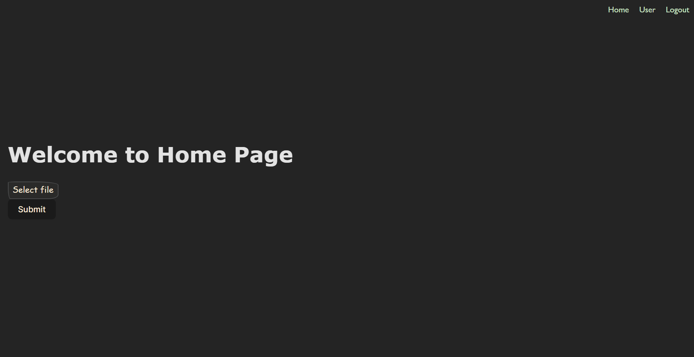

# Official Website of Birendra Open source club

This website will be built using React framework and vite.js will be used as a bundler.
For now, we'll use javascript, and later we'll migrate to typescript.
The Open source community all over Nepal will help us to build this website and make it better.

## First Time Contributing?

Go to `Contributing.md` file and follow the steps to make your first contribution to open source world.

Also be sure to first contribute to our [First Contributions](https://github.com/bosc-official/first-contributions) repository to get familiar with the open source world.

## How to run this project locally?

This project is built using React framework and vite.js is used as a bundler. So, you need to have node.js and react.js and vite.js installed in your system to run this project locally.

1. Clone this repository.
2. Run `npm install` to install all the dependencies.
3. Run `npm run dev` to start the development server.

## What to do?

There are many things to do in this project. You can choose any of the following tasks and start working on it. If you have any other ideas, you can also work on it. Just make sure to create an issue first and then start working on it.

For now, we'll build the website from the figma design. You can find the design [here](https://www.figma.com/file/0Z0Z1ZQZ1ZQZ1ZQZ1ZQZ1Z/BOSC-Website?node-id=0%3A1). You can also find the design in the `design` folder in this repository. Some of the designs images are also given below.

Until the figma design is not ready, the basic task we expect to get completed in this october Hacktoberfest month are:

- [ ] Create a landing page for the website (about us, contact us, sponsors, gallery, team members, FAQs).
- [x] Create a navbar for the website.
- [x] Create a footer for the website.
- [ ] Create a page for the events.
- [ ] Create a page for the blogs.
- [ ] Create a page for the projects.
- [ ] Create a page for the resources.
- [x] Create a page for the login.
- [x] Create a page for the signup.
- [ ] Create a page for the profile.

## Why ?

You get to contribute in a industry standard maintained repository. You get to learn how to work in a team and how to collaborate with other developers. You get to learn how to use git and github. You get to learn how to use react.js and vite.js. You get to learn how to use figma. You get to learn how to use tailwindcss. You get to learn how to use react-router-dom. react-hook-form. react-icons. react-toastify.

## Looks

The website looks somethings like this and changes will be made as we progress.

## License

This project is licensed under the MIT License. See the [LICENSE](./LICENSE) file for details.
